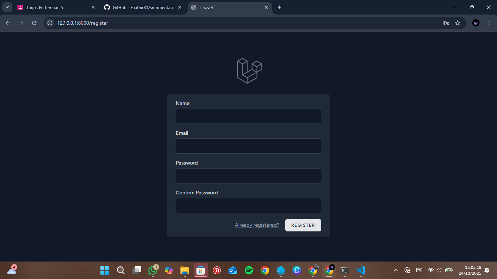
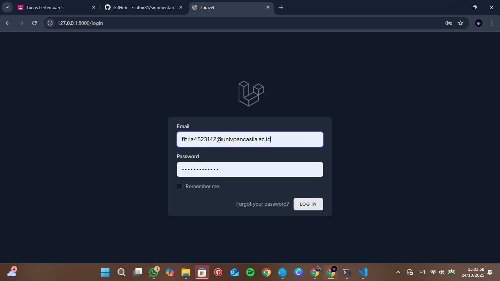
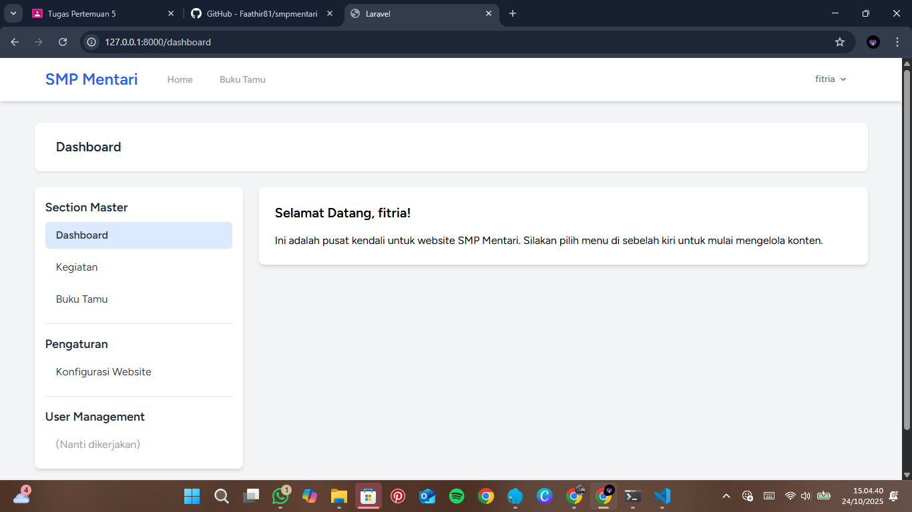
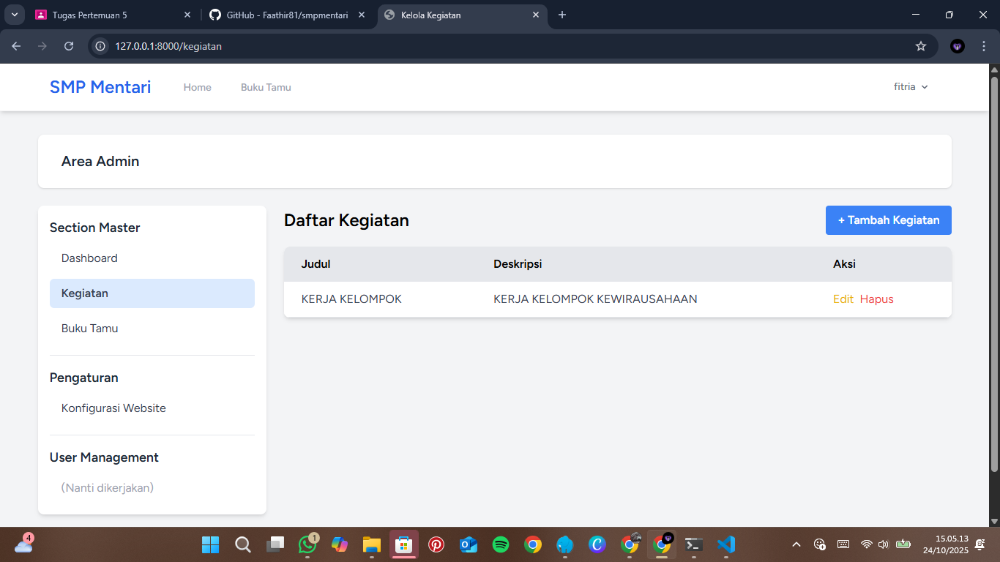

# Pertemuan 5 - Bagian 1: git clone melalui link Github

# SMP MENTARI
Pada pertemuan ini, kita telah berhasil menambahkan Proyek ini merupakan aplikasi berbasis web yang dikembangkan menggunakan Laravel untuk membantu pengelolaan data sekolah, khususnya di SMP Mentari.
Aplikasi ini memiliki fitur CRUD (Create, Read, Update, Delete) untuk mengelola data seperti siswa, guru, dan kelas.

## nama dan NPM
- *Nama : Fitria Dwi*
- *NPM  : 4523210142*

## keterangan

Aplikasi ini dibuat sebagai bagian dari praktikum pemrograman berbasis web menggunakan framework Laravel.
Proyek ini menekankan pada penerapan struktur MVC (Model-View-Controller) dan pengelolaan data menggunakan CRUD operations di Laravel.

## Langkah-Langkah Menjalankan Proyek
1. Clone Repository dari GitHub
    git clone https://github.com/adiwp/smpmentari.git
2. masuk ke folder proyek

    _cd smpmentari_

3. Instal Dependensi Laravel 
    Pastikan Composer sudah terpasang di komputer Anda, lalu jalankan: 

    _composer install_

4. konfigurasi file env

    _cp .env.example .env_

5. generate Application key

    _php artisan key:generate_

6. jalankan migrasi database

    _php artisan migrate_

7. instalasi dependesni frontend

    _npm install_

    _npm run dev_
8. JAlankan Server Aplikasi

    _php artisan serve_
    
    _http://127.0.0.1:8000_
9. Tampilan

    ### tampilan register

    

    ### tampilan Login
    

    ### Tampilan Dashboard
    

    ### Tampilan kegiatan setelah di tambahkan 

    

